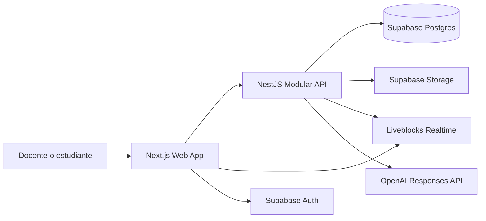
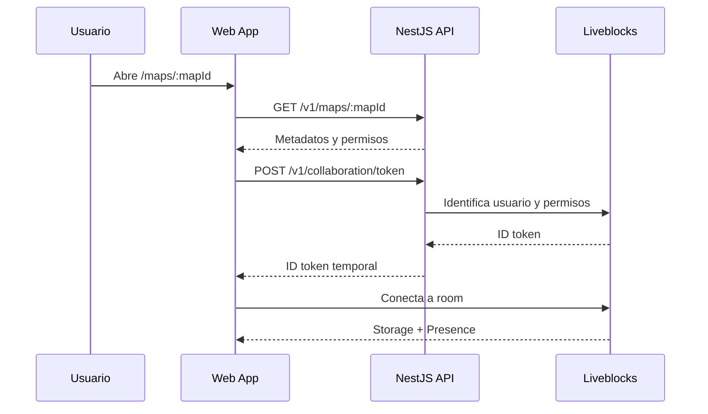

# MindMap Live — Especificación de Arquitectura Frontend

**Documento:** `01_FRONTEND_ARCHITECTURE.md`  
**Versión:** 1.0  
**Fecha:** 2026-06-03  
**Estado:** Especificación base para construcción del MVP  
**Producto:** MindMap Live  
**Audiencia:** Frontend developers, UX/UI, QA, Product Owner, arquitectos y futuros equipos de plataforma.

---

## 1. Propósito del documento

Este documento define la arquitectura frontend de **MindMap Live**, una plataforma SaaS educativa para crear mapas mentales colaborativos en tiempo real entre docentes y estudiantes, con apoyo de inteligencia artificial para:

1. Recomendar nodos e ideas secundarias.
2. Resolver dudas sobre el contenido del mapa.
3. Facilitar la organización visual de conceptos.
4. Incrementar la participación activa durante clases, talleres y dinámicas grupales.

La arquitectura está diseñada como un **frontend modular**, no como una colección de páginas acopladas. El MVP debe poder crecer sin reescrituras traumáticas: cada módulo funcional tendrá límites explícitos, contratos propios y dependencias controladas. Esta separación permitirá que, cuando el producto escale, el backend pueda fragmentarse en microservicios y el frontend pueda evolucionar a microfrontends solamente si existe una necesidad real.

---

## 2. Alcance del MVP

### 2.1 Funcionalidades incluidas

El MVP deberá incluir:

- Registro e inicio de sesión.
- Perfil básico del usuario.
- Roles de docente y estudiante.
- Espacios de trabajo para instituciones o pilotos.
- Cursos y membresías.
- Creación, edición, listado y apertura de mapas mentales.
- Canvas colaborativo basado en nodos y conexiones.
- Nodo raíz y nodos secundarios.
- Creación, edición, eliminación y movimiento de nodos.
- Creación y eliminación de conexiones entre nodos.
- Cursores y presencia de participantes conectados.
- Indicador de conexión, reconexión y sincronización.
- Permisos de propietario, editor y lector.
- Sesiones colaborativas compartidas por enlace o código.
- Recomendaciones de nodos generadas por IA.
- Panel lateral de preguntas y respuestas con IA.
- Aceptación o rechazo explícito de sugerencias de IA.
- Guardado automático del estado colaborativo.
- Snapshots de recuperación solicitados al backend.
- Interfaz optimizada para conectividad moderada.
- Instrumentación mínima para errores y métricas de uso.

### 2.2 Fuera del alcance inicial

No deben bloquear el lanzamiento del MVP:

- Edición completamente offline.
- Aplicación móvil nativa.
- Microfrontends.
- Marketplace de plantillas.
- Analítica educativa avanzada.
- Gamificación.
- Evaluación automática del estudiante.
- Agentes de IA que modifiquen el mapa sin confirmación humana.
- RAG sobre documentos cargados por el profesor.
- Comentarios avanzados sobre nodos.
- Historial visual completo tipo Git.
- Exportación avanzada a múltiples formatos.
- Integración con LMS externos.

Estos elementos pueden añadirse posteriormente mediante módulos separados.

---

## 3. Objetivos no funcionales

| Objetivo | Criterio para el MVP |
|---|---|
| Colaboración | Soportar hasta 15 usuarios concurrentes por sesión piloto. |
| Latencia | Objetivo técnico: actualizaciones colaborativas percibidas en menos de 200 ms bajo condiciones normales de prueba. |
| Usabilidad | Un usuario nuevo debe poder crear un mapa y agregar nodos sin capacitación extensa. |
| Rendimiento | Evitar rerenders innecesarios del canvas y cargas pesadas en la vista principal. |
| Conectividad | Mostrar estado de red y tolerar reconexiones sin bloquear toda la experiencia. |
| Seguridad | No exponer claves privadas de OpenAI, Liveblocks ni Supabase Service Role. |
| Escalabilidad | Mantener módulos independientes y contratos tipados para facilitar extracción futura. |
| Accesibilidad | Permitir navegación básica con teclado, etiquetas accesibles y contraste suficiente. |
| Observabilidad | Registrar errores frontend y eventos clave del recorrido del usuario. |

---

## 4. Decisión arquitectónica

### 4.1 Stack recomendado

| Capa | Tecnología | Responsabilidad |
|---|---|---|
| Framework web | Next.js con App Router | Rutas, layouts, renderizado, carga inicial y estructura de aplicación. |
| Lenguaje | TypeScript estricto | Seguridad de tipos y contratos consistentes. |
| UI | React | Componentes interactivos y composición de vistas. |
| Canvas | `@xyflow/react` | Nodos, edges, zoom, paneo, selección y controles visuales. |
| Colaboración | `@liveblocks/react`, `@liveblocks/client`, `@liveblocks/react-flow` | Presencia, cursores, almacenamiento compartido y sincronización del flow. |
| Estado local | Zustand | Estado efímero de UI: paneles, toolbars, selección local y preferencias visuales. |
| Server state | TanStack Query | Caché, reintentos, invalidación y consultas al backend. |
| Formularios | React Hook Form + Zod | Formularios tipados y validación en cliente. |
| Estilos | Tailwind CSS | Diseño consistente y rápido de mantener. |
| Componentes base | shadcn/ui | Componentes reutilizables sin acoplamiento fuerte. |
| Autenticación | Supabase Auth SDK | Sesión del usuario y obtención del access token. |
| Pruebas unitarias | Vitest + React Testing Library | Validación de componentes y lógica. |
| Pruebas E2E | Playwright | Flujos reales del usuario y colaboración básica. |
| Calidad | ESLint + Prettier | Convenciones y consistencia. |
| Monorepo | pnpm workspaces + Turborepo | Compartir contratos y configuración con backend. |
| Despliegue | Vercel | Publicación del frontend. |

### 4.2 Por qué esta arquitectura

React Flow está orientado a interfaces basadas en nodos y conexiones, que coinciden con el dominio visual de MindMap Live. Liveblocks reduce el riesgo técnico del tiempo real porque evita implementar desde cero sincronización, presencia y resolución de conflictos. Next.js permite estructurar la aplicación por rutas y separar Server Components de Client Components. Zustand se utilizará únicamente para estado local de interacción; no reemplazará a Liveblocks ni a TanStack Query.

### 4.3 Regla principal

> Cada dato debe tener un único propietario de estado.

No se debe copiar indiscriminadamente el mismo dato en Zustand, Liveblocks, TanStack Query y componentes locales. Esta regla evita estados inconsistentes.

---

## 5. Vista general del sistema



### 5.1 Responsabilidades del frontend

El frontend deberá:

- Renderizar la experiencia del usuario.
- Consumir únicamente contratos públicos del backend.
- Gestionar la sesión Supabase del usuario.
- Solicitar tokens temporales de acceso a Liveblocks mediante el backend.
- Mantener el canvas sincronizado usando Liveblocks.
- Enviar preguntas y solicitudes de sugerencias al backend.
- Mostrar respuestas transmitidas progresivamente.
- Controlar la experiencia ante errores, permisos insuficientes y reconexiones.

El frontend **no** deberá:

- Acceder directamente a secretos del servidor.
- Autorizar permisos por sí mismo.
- Construir prompts finales de IA como fuente de verdad.
- Persistir nodos directamente en Postgres en cada movimiento.
- Asumir que un usuario puede editar solamente porque logró abrir la ruta.

---

## 6. Organización del repositorio

Se recomienda un monorepo:

```text
mindmap-live/
├─ apps/
│  ├─ web/                     # Next.js frontend
│  └─ api/                     # NestJS backend
├─ packages/
│  ├─ contracts/               # DTOs, schemas Zod, eventos y tipos compartidos
│  ├─ ui/                      # Componentes UI reutilizables
│  ├─ eslint-config/
│  ├─ tsconfig/
│  └─ test-utils/
├─ infrastructure/
│  ├─ supabase/
│  └─ deployment/
├─ docs/
│  ├─ 01_FRONTEND_ARCHITECTURE.md
│  └─ 02_BACKEND_ARCHITECTURE.md
├─ package.json
├─ pnpm-workspace.yaml
└─ turbo.json
```

### 6.1 Estructura interna de `apps/web`

```text
apps/web/
├─ app/
│  ├─ (public)/
│  │  ├─ page.tsx
│  │  ├─ login/page.tsx
│  │  ├─ register/page.tsx
│  │  └─ join/[token]/page.tsx
│  ├─ (protected)/
│  │  ├─ layout.tsx
│  │  ├─ dashboard/page.tsx
│  │  ├─ workspaces/[workspaceId]/page.tsx
│  │  ├─ courses/[courseId]/page.tsx
│  │  ├─ maps/[mapId]/page.tsx
│  │  ├─ settings/page.tsx
│  │  └─ profile/page.tsx
│  ├─ error.tsx
│  ├─ loading.tsx
│  ├─ not-found.tsx
│  └─ layout.tsx
├─ src/
│  ├─ modules/
│  │  ├─ auth/
│  │  ├─ profiles/
│  │  ├─ workspaces/
│  │  ├─ courses/
│  │  ├─ maps/
│  │  ├─ canvas/
│  │  ├─ collaboration/
│  │  ├─ ai-assistant/
│  │  ├─ sessions/
│  │  └─ telemetry/
│  ├─ shared/
│  │  ├─ api/
│  │  ├─ auth/
│  │  ├─ components/
│  │  ├─ hooks/
│  │  ├─ lib/
│  │  ├─ store/
│  │  ├─ styles/
│  │  └─ types/
│  └─ middleware/
├─ public/
├─ tests/
└─ package.json
```

---

## 7. Principios de modularidad frontend

### 7.1 Módulos funcionales

Cada módulo se organiza como una vertical slice:

```text
src/modules/maps/
├─ api/
│  ├─ maps.client.ts
│  └─ maps.queries.ts
├─ components/
│  ├─ MapCard.tsx
│  ├─ MapList.tsx
│  └─ CreateMapDialog.tsx
├─ hooks/
│  └─ useMaps.ts
├─ schemas/
│  └─ map.schema.ts
├─ types/
│  └─ map.types.ts
├─ utils/
└─ index.ts
```

### 7.2 Reglas de dependencia

1. Un módulo puede importar utilidades desde `shared`.
2. Un módulo no debe importar archivos internos profundos de otro módulo.
3. Toda interacción entre módulos debe usar el `index.ts` público o contratos compartidos.
4. Los tipos de API deben provenir de `packages/contracts`.
5. El módulo `canvas` no debe conocer detalles de Supabase ni OpenAI.
6. El módulo `ai-assistant` no debe modificar nodos directamente; debe producir propuestas y delegar la aplicación de cambios al módulo `canvas`.
7. El módulo `collaboration` encapsula Liveblocks; el resto del frontend no debe dispersar llamadas a Liveblocks por toda la aplicación.
8. No se implementarán microfrontends en el MVP. La modularidad debe permitirlos en el futuro, pero no justificar complejidad anticipada.

### 7.3 Contratos públicos por módulo

Cada módulo debe exportar solamente:

- Componentes públicos.
- Hooks públicos.
- Tipos necesarios.
- Funciones cliente aprobadas.
- Eventos de UI documentados.

---

## 8. Rutas del producto

| Ruta | Protección | Propósito |
|---|---|---|
| `/` | Pública | Landing básica o redirección al dashboard. |
| `/login` | Pública | Inicio de sesión. |
| `/register` | Pública | Registro de usuario. |
| `/join/[token]` | Pública con flujo controlado | Resolver invitación o código compartido. |
| `/dashboard` | Autenticada | Resumen del usuario, cursos y mapas recientes. |
| `/workspaces/[workspaceId]` | Autenticada y autorizada | Espacio institucional o personal. |
| `/courses/[courseId]` | Autenticada y autorizada | Curso, miembros y mapas vinculados. |
| `/maps/[mapId]` | Autenticada y autorizada | Canvas colaborativo. |
| `/profile` | Autenticada | Datos básicos del perfil. |
| `/settings` | Autenticada | Preferencias del usuario. |

### 8.1 Protección de rutas

La protección visual en Next.js mejora la experiencia, pero no reemplaza la autorización del backend. Cada request relevante deberá incluir un bearer token válido y cada operación será autorizada nuevamente por el API.

---

## 9. Pantallas del MVP

### 9.1 Login y registro

**Requisitos:**

- Inicio de sesión por correo y contraseña.
- Opción de OAuth con Google cuando el entorno esté configurado.
- Manejo de error legible.
- Redirección a `/dashboard`.
- Persistencia segura de sesión usando el SDK de Supabase.

### 9.2 Dashboard

**Elementos:**

- Saludo y perfil breve.
- Tarjeta de mapas recientes.
- Tarjeta de cursos.
- Botón `Crear mapa`.
- Campo para ingresar código de sesión.
- Listado de invitaciones pendientes.
- Indicador de mapas modificados recientemente.

### 9.3 Curso

**Elementos:**

- Nombre del curso.
- Rol del usuario en el curso.
- Miembros.
- Mapas vinculados.
- Crear mapa.
- Crear sesión colaborativa.
- Copiar enlace o código de invitación.

### 9.4 Editor de mapa

Debe ser la vista principal del MVP.

```text
┌───────────────────────────────────────────────────────────────┐
│ Topbar: título | conexión | participantes | compartir | salir │
├───────────────┬──────────────────────────────────┬────────────┤
│ Toolbar       │                                  │ Panel IA   │
│ + Nodo        │         Canvas React Flow        │ Preguntar  │
│ Conectar      │                                  │ Sugerir    │
│ Organizar     │                                  │ Historial  │
│ Snapshot      │                                  │            │
├───────────────┴──────────────────────────────────┴────────────┤
│ Barra de estado: sincronizado / reconectando / error          │
└───────────────────────────────────────────────────────────────┘
```

### 9.5 Panel IA

Dos pestañas:

1. **Sugerencias**
   - Nodo seleccionado.
   - Lista de propuestas.
   - Motivo breve.
   - Botones `Agregar`, `Descartar`, `Agregar todas`.
   - Las propuestas no se insertan automáticamente.

2. **Preguntas**
   - Historial de conversación.
   - Caja de texto.
   - Respuesta transmitida progresivamente.
   - Referencia al nodo o rama seleccionada.
   - Mensaje de límite o error cuando corresponda.

---

## 10. Modelo visual del canvas

### 10.1 Tipos de nodos

```ts
export type MindMapNodeType =
  | "root"
  | "concept"
  | "question"
  | "example"
  | "ai-suggestion";
```

### 10.2 Contrato de nodo

```ts
export type MindMapNodeData = {
  label: string;
  description?: string;
  nodeType: MindMapNodeType;
  createdBy: string;
  createdAt: string;
  updatedAt: string;
  source?: "human" | "ai";
  colorToken?: string;
  collapsed?: boolean;
};

export type MindMapNode = {
  id: string;
  type: "mindMapNode";
  position: { x: number; y: number };
  data: MindMapNodeData;
};
```

### 10.3 Contrato de conexión

```ts
export type MindMapEdge = {
  id: string;
  source: string;
  target: string;
  type?: "smoothstep" | "default";
  data?: {
    createdBy: string;
    createdAt: string;
  };
};
```

### 10.4 Reglas de negocio visuales

- Todo mapa debe tener exactamente un nodo raíz activo.
- El nodo raíz no puede eliminarse mientras el mapa exista.
- Un nodo secundario puede tener uno o más vínculos, pero el modo guiado del MVP debe favorecer estructura jerárquica.
- La interfaz debe advertir conexiones duplicadas.
- La eliminación de un nodo debe solicitar confirmación si tiene conexiones.
- Las sugerencias de IA deben distinguirse visualmente antes de ser aceptadas.
- La organización automática puede utilizar `dagre` como ayuda visual.
- El canvas debe incluir `Controls`, `MiniMap` opcional y ajuste de viewport.

---

## 11. Estado y sincronización

### 11.1 Matriz de propietarios de estado

| Tipo de dato | Propietario | Ejemplo |
|---|---|---|
| Datos administrativos remotos | TanStack Query + API | cursos, mapas, miembros, permisos |
| Estado colaborativo persistente | Liveblocks Storage | nodos, edges, metadatos mínimos del canvas |
| Presencia efímera | Liveblocks Presence | cursor, usuario conectado, nodo seleccionado |
| UI efímera local | Zustand | panel IA abierto, toolbar activa, filtros locales |
| Formularios | React Hook Form | título del mapa, creación de curso |
| Sesión de autenticación | Supabase Auth SDK | access token y refresh de sesión |

### 11.2 Almacenamiento colaborativo

```ts
export type CanvasStorage = {
  schemaVersion: number;
  rootNodeId: string;
  nodes: MindMapNode[];
  edges: MindMapEdge[];
};
```

### 11.3 Presencia

```ts
export type CanvasPresence = {
  cursor: { x: number; y: number } | null;
  selectedNodeIds: string[];
  displayName: string;
  avatarUrl?: string;
  role: "teacher" | "student";
  status: "active" | "idle";
};
```

### 11.4 No duplicar el canvas en Postgres

El canvas activo debe vivir en Liveblocks Storage. El frontend no enviará un request a Postgres por cada píxel de movimiento. El backend almacenará snapshots de recuperación en momentos controlados, por ejemplo:

- Creación del mapa.
- Cierre de sesión.
- Snapshot manual del docente.
- Antes de una migración de esquema.
- Checkpoint periódico si se habilita posteriormente.

---

## 12. Integración con Liveblocks

### 12.1 Flujo de acceso



### 12.2 Room ID

Convención:

```text
mindmap:{mapId}
```

Ejemplo:

```text
mindmap:5a7599c8-34e4-45d7-bfe2-a27331cf196e
```

No se utilizarán títulos o correos en el `roomId`.

### 12.3 Manejo de conexión

Mostrar siempre uno de estos estados:

```ts
type CollaborationStatus =
  | "connecting"
  | "connected"
  | "reconnecting"
  | "synchronized"
  | "error";
```

### 12.4 Conectividad moderada

Aplicar:

- Throttle para movimiento de cursor.
- Componentes de nodo memoizados.
- Evitar animaciones costosas.
- Lazy loading del panel IA.
- No descargar materiales pesados al abrir el canvas.
- Mostrar reconexión sin borrar la vista.
- Mantener operaciones breves y reversibles.
- Deshabilitar temporalmente acciones de IA si no existe conectividad suficiente.

---

## 13. Integración con IA

### 13.1 Principio de control humano

La IA recomienda; el usuario decide. En el MVP la IA no debe alterar el mapa silenciosamente.

### 13.2 Sugerencia de nodos

Request:

```http
POST /v1/maps/{mapId}/ai/suggestions
Authorization: Bearer <supabase_access_token>
Content-Type: application/json
```

```json
{
  "selectedNodeId": "node-fase-luminosa",
  "intent": "expand-branch",
  "maxSuggestions": 4
}
```

Response:

```json
{
  "requestId": "a6b4d82e-1c16-4d8e-87dd-bf7b63c387de",
  "suggestions": [
    {
      "id": "b52cfedf-946a-42fd-91c6-a0d39f09cb43",
      "label": "Fotólisis del agua",
      "description": "Proceso que libera oxígeno durante la fase luminosa.",
      "reason": "Completa la explicación del origen del oxígeno.",
      "parentNodeId": "node-fase-luminosa"
    }
  ]
}
```

### 13.3 Aplicación de una sugerencia

El frontend:

1. Recibe la sugerencia.
2. Muestra la propuesta.
3. El usuario pulsa `Agregar`.
4. El módulo `ai-assistant` emite un comando UI.
5. El módulo `canvas` crea el nodo en Liveblocks.
6. El frontend informa al backend si la sugerencia fue aceptada o rechazada.

```http
POST /v1/maps/{mapId}/ai/suggestions/{suggestionId}/decision
```

```json
{
  "decision": "accepted"
}
```

### 13.4 Preguntas y respuestas

```http
POST /v1/maps/{mapId}/ai/questions
Accept: text/event-stream
```

```json
{
  "conversationId": "optional-existing-id",
  "question": "¿Cuál es la diferencia entre ATP y NADPH?",
  "selectedNodeId": "node-fase-luminosa"
}
```

La respuesta se mostrará progresivamente mediante SSE.

### 13.5 Contexto enviado a IA

El frontend no construirá el prompt final. Solo enviará:

- `mapId`
- `selectedNodeId`
- pregunta del usuario
- intención
- límites solicitados

El backend obtendrá y sanitizará el contexto autorizado.

---

## 14. Cliente HTTP y contratos

### 14.1 Cliente único

```text
src/shared/api/
├─ http-client.ts
├─ api-error.ts
├─ query-client.ts
└─ auth-interceptor.ts
```

### 14.2 Reglas

- Base URL mediante `NEXT_PUBLIC_API_URL`.
- Bearer token inyectado desde Supabase Auth.
- Manejo unificado de `401`, `403`, `404`, `409`, `422`, `429` y `5xx`.
- Correlation ID recibido y registrado.
- Timeouts razonables.
- Reintentos únicamente en operaciones idempotentes.
- No reintentar automáticamente creación de mapa sin idempotency key.

### 14.3 Formato estándar de error

```ts
export type ApiErrorResponse = {
  code: string;
  message: string;
  correlationId: string;
  details?: Record<string, unknown>;
};
```

---

## 15. Permisos

### 15.1 Roles de workspace

| Rol | Capacidades |
|---|---|
| `owner` | Control total del workspace. |
| `admin` | Gestiona cursos, usuarios y mapas institucionales. |
| `teacher` | Crea cursos, mapas y sesiones. |
| `student` | Participa en cursos y mapas autorizados. |

### 15.2 Permisos por mapa

| Permiso | Ver | Editar | Compartir | Snapshot | Eliminar |
|---|---:|---:|---:|---:|---:|
| `owner` | Sí | Sí | Sí | Sí | Sí |
| `editor` | Sí | Sí | No | No | No |
| `viewer` | Sí | No | No | No | No |

### 15.3 Aplicación frontend

La UI ocultará o deshabilitará acciones no permitidas. El backend seguirá siendo la autoridad final.

---

## 16. Componentes principales

### 16.1 Árbol de componentes del editor

```text
MapEditorPage
├─ MapEditorShell
│  ├─ MapTopbar
│  │  ├─ EditableMapTitle
│  │  ├─ CollaborationStatusBadge
│  │  ├─ ParticipantAvatarStack
│  │  └─ ShareSessionDialog
│  ├─ CanvasToolbar
│  │  ├─ AddNodeButton
│  │  ├─ ConnectModeButton
│  │  ├─ AutoLayoutButton
│  │  └─ SnapshotButton
│  ├─ MindMapCanvas
│  │  ├─ ReactFlowProvider
│  │  ├─ ReactFlow
│  │  ├─ MindMapNode
│  │  ├─ Controls
│  │  ├─ MiniMap
│  │  └─ CollaborativeCursors
│  ├─ AiAssistantPanel
│  │  ├─ AiSuggestionList
│  │  ├─ AiQuestionThread
│  │  └─ AiComposer
│  └─ MapStatusBar
```

### 16.2 Componentes compartidos

```text
packages/ui/
├─ Button
├─ Dialog
├─ Drawer
├─ Toast
├─ Badge
├─ Avatar
├─ Tooltip
├─ Skeleton
├─ EmptyState
└─ ErrorState
```

---

## 17. UX de errores

| Escenario | Comportamiento esperado |
|---|---|
| Sesión expirada | Intentar refrescar sesión; si falla, redirigir a login. |
| Sin permisos | Mostrar vista 403 y opción de volver. |
| Room no disponible | Mostrar error recuperable y botón de reconectar. |
| IA temporalmente no disponible | Mantener el canvas operativo y mostrar aviso no bloqueante. |
| Límite de IA alcanzado | Mostrar mensaje y mantener historial. |
| Snapshot fallido | Avisar; no bloquear edición. |
| Código vencido | Mostrar mensaje claro y solicitar un nuevo enlace al docente. |
| Conectividad lenta | Mostrar `Reconectando...`; no ocultar mapa existente. |

---

## 18. Rendimiento del canvas

### 18.1 Reglas obligatorias

- Memoizar nodos personalizados.
- Evitar cálculos costosos durante cada movimiento.
- No recalcular layout automáticamente en cada edición.
- Ejecutar auto-layout solamente por acción explícita.
- Limitar elementos visuales decorativos.
- Throttle para presencia y cursor.
- Cargar el panel IA mediante lazy loading.
- Evitar pasar objetos nuevos innecesarios como props.
- Separar estado colaborativo de UI local.
- Instrumentar cantidad de nodos, edges y participantes.

### 18.2 Presupuestos iniciales

| Métrica | Presupuesto MVP |
|---|---|
| Participantes concurrentes por room | 15 |
| Nodos recomendados por mapa piloto | Hasta 300 |
| Edges recomendados por mapa piloto | Hasta 500 |
| Tiempo de carga inicial objetivo | Menor a 3 segundos en red estable |
| Respuesta visual al mover nodo | Fluida en equipo promedio |
| Contexto IA enviado | Solamente rama relevante y metadatos necesarios |

---

## 19. Accesibilidad

Requisitos mínimos:

- Foco visible.
- Botones con etiquetas claras.
- Tooltips en acciones iconográficas.
- Navegación básica por teclado.
- Contraste suficiente.
- No depender únicamente del color para distinguir sugerencias.
- `aria-label` en botones del canvas.
- Mensajes de estado de conexión accesibles.
- Alternativa textual del mapa para iteraciones posteriores.

---

## 20. Telemetría frontend

Eventos recomendados:

```ts
type FrontendEvent =
  | "auth.login.succeeded"
  | "auth.login.failed"
  | "map.opened"
  | "map.node.created"
  | "map.node.deleted"
  | "map.edge.created"
  | "collaboration.connected"
  | "collaboration.reconnecting"
  | "collaboration.failed"
  | "ai.suggestion.requested"
  | "ai.suggestion.accepted"
  | "ai.suggestion.rejected"
  | "ai.question.sent"
  | "snapshot.requested";
```

No registrar:

- Texto completo de preguntas sin una política aprobada.
- Contenido sensible del mapa.
- Tokens de autenticación.
- Claves privadas.
- Datos personales innecesarios.

---

## 21. Variables de entorno frontend

```bash
NEXT_PUBLIC_APP_NAME="MindMap Live"
NEXT_PUBLIC_API_URL="http://localhost:4000/v1"
NEXT_PUBLIC_SUPABASE_URL=""
NEXT_PUBLIC_SUPABASE_ANON_KEY=""
NEXT_PUBLIC_ENABLE_GOOGLE_AUTH="false"
NEXT_PUBLIC_ENABLE_AI="true"
NEXT_PUBLIC_ENABLE_MINIMAP="true"
NEXT_PUBLIC_SENTRY_DSN=""
```

### 21.1 Variables prohibidas en frontend

Nunca deben aparecer en variables `NEXT_PUBLIC_*`:

```text
OPENAI_API_KEY
LIVEBLOCKS_SECRET_KEY
SUPABASE_SERVICE_ROLE_KEY
DATABASE_URL
```

---

## 22. Pruebas frontend

### 22.1 Unitarias

Cubrir:

- Validaciones Zod.
- Conversión de errores API.
- Comandos de creación de nodo.
- Reglas del nodo raíz.
- Aplicación y rechazo de sugerencias.
- Permisos visuales.
- Stores Zustand.

### 22.2 Integración

Cubrir:

- Login.
- Crear mapa.
- Abrir canvas.
- Crear nodo.
- Eliminar nodo.
- Crear edge.
- Mostrar usuarios conectados.
- Solicitar sugerencia IA.
- Agregar sugerencia aceptada.
- Preguntar a IA.
- Crear snapshot.

### 22.3 E2E

Escenarios Playwright:

1. Docente crea un mapa.
2. Docente comparte sesión.
3. Estudiante ingresa por código.
4. Ambos visualizan presencia.
5. Docente crea nodo.
6. Estudiante observa actualización.
7. Estudiante mueve nodo.
8. Docente observa actualización.
9. Docente solicita sugerencias IA.
10. Docente acepta una sugerencia.
11. Ambos observan el nuevo nodo.
12. Se simula desconexión y reconexión.

---

## 23. Criterios de aceptación frontend del MVP

- [ ] El usuario puede registrarse e iniciar sesión.
- [ ] El usuario puede ver sus cursos y mapas.
- [ ] Un docente puede crear un mapa.
- [ ] Un docente puede compartir una sesión mediante enlace o código.
- [ ] Un estudiante autorizado puede ingresar.
- [ ] Dos navegadores pueden editar el mismo mapa.
- [ ] Los cursores se visualizan.
- [ ] Los nodos pueden crearse, editarse, moverse y eliminarse.
- [ ] Las conexiones pueden crearse y eliminarse.
- [ ] El nodo raíz está protegido.
- [ ] El indicador de sincronización funciona.
- [ ] Una reconexión no borra el canvas.
- [ ] El usuario puede solicitar sugerencias IA.
- [ ] La sugerencia no se inserta hasta ser aceptada.
- [ ] El usuario puede formular preguntas y visualizar streaming.
- [ ] Las acciones no autorizadas no aparecen o se muestran deshabilitadas.
- [ ] El canvas mantiene rendimiento aceptable con la carga piloto.

---

## 24. Evolución futura

### 24.1 Fase 2

- Materiales de curso.
- Carga de PDFs.
- RAG con permisos.
- Comentarios sobre nodos.
- Exportación a imagen y PDF.
- Historial de snapshots.
- Plantillas.
- Modo presentación.
- Resumen automático del mapa.

### 24.2 Fase 3

- IA como participante visible.
- Propuestas de reorganización de ramas.
- Detección de duplicados.
- Moderación de aportes.
- Métricas pedagógicas.
- Integraciones LMS.
- Aplicación móvil o PWA avanzada.

### 24.3 Cuándo considerar microfrontends

Solo evaluar microfrontends si:

- Existen equipos autónomos por dominio.
- Los despliegues independientes generan valor real.
- El editor, analítica y administración evolucionan a ritmos muy distintos.
- El costo operativo adicional está justificado.

No implementarlos durante el MVP.

---

## 25. Definition of Done frontend

Una funcionalidad frontend se considera terminada cuando:

- Respeta límites modulares.
- Usa contratos compartidos.
- Incluye estados de carga, vacío y error.
- Incluye permisos visuales.
- Tiene pruebas unitarias mínimas.
- Tiene pruebas de integración cuando afecta recorrido crítico.
- No expone secretos.
- Cumple lint y typecheck.
- Está instrumentada si forma parte de un evento clave.
- Fue validada en desktop y viewport tablet.
- No degrada el canvas colaborativo.

---

## 26. Referencias técnicas oficiales

- Next.js App Router: https://nextjs.org/docs/app
- Next.js Route Handlers: https://nextjs.org/docs/app/getting-started/route-handlers
- React Flow: https://reactflow.dev/
- React Flow Mind Map Tutorial: https://reactflow.dev/learn/tutorials/mind-map-app-with-react-flow
- React Flow Performance: https://reactflow.dev/learn/advanced-use/performance
- Liveblocks React Flow Example: https://liveblocks.io/examples/collaborative-flowchart/nextjs-react-flow
- Liveblocks React API: https://liveblocks.io/docs/api-reference/liveblocks-react
- Supabase Auth: https://supabase.com/docs/guides/auth
- Supabase RLS: https://supabase.com/docs/guides/database/postgres/row-level-security

---

## 27. Resumen ejecutivo para implementación

Construir el frontend como una aplicación Next.js modular. Mantener la colaboración encapsulada en el módulo `collaboration`, el canvas en `canvas`, la IA en `ai-assistant` y los contratos compartidos en `packages/contracts`. Utilizar Liveblocks como fuente de verdad del estado vivo del canvas y el backend como autoridad de acceso, metadatos y operaciones de IA. No duplicar datos entre stores. No introducir microfrontends ni complejidad distribuida antes de validar el MVP.
